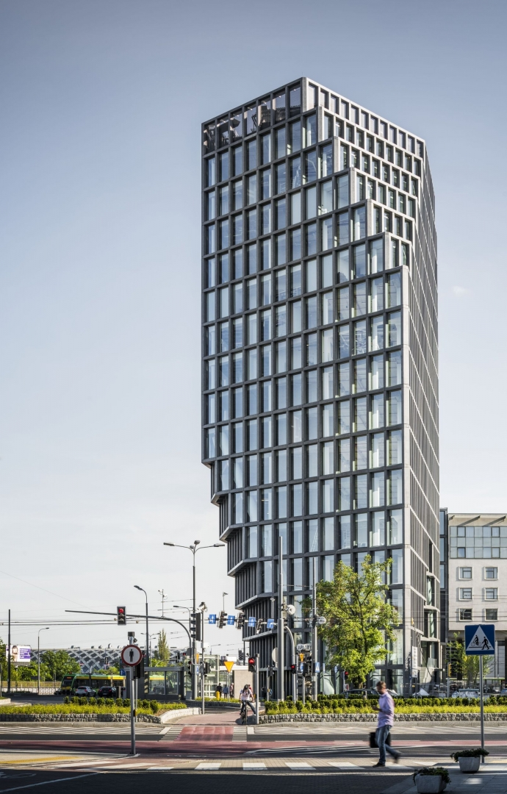
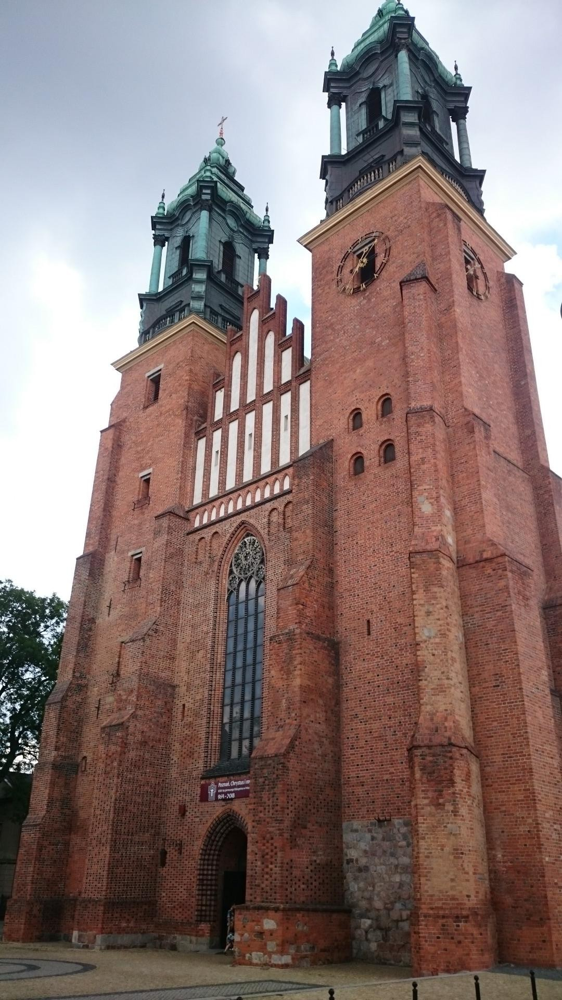
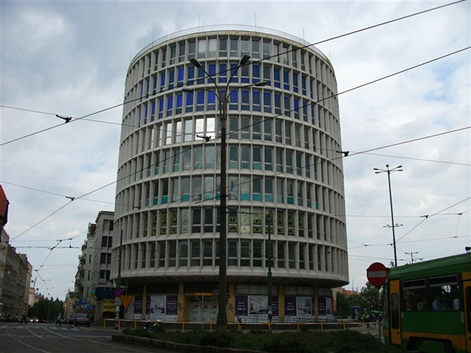
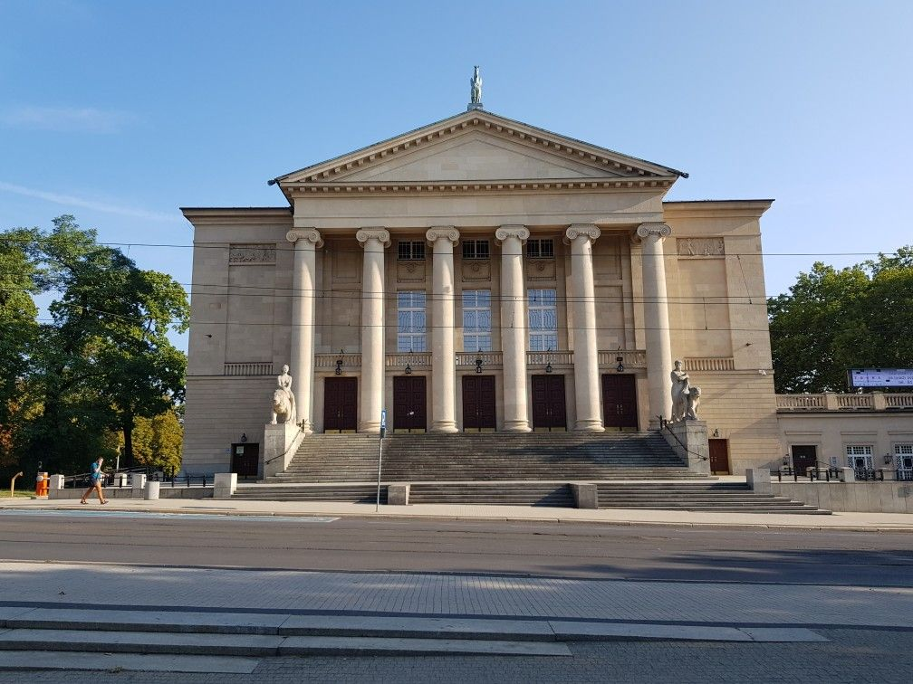
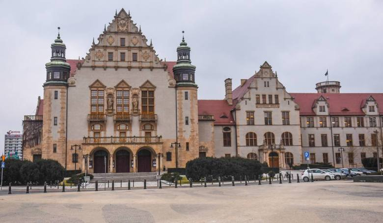

# Bag of Visual Words
## Goal: 
Recognize popular buildings from Poznań with Bag of Visual Words. 

## Data: 
Data provided by a lecturer. 
Data contains 5 classes, 32 image per class. 
### Classes:
* Bałtyk 
* Katedra
* Okrąglak
* Teatr_Wielki
* UAM

  
   
  

  
   

### Results: 
Accuracy: ~89%
Model trained on not augmented data. 
